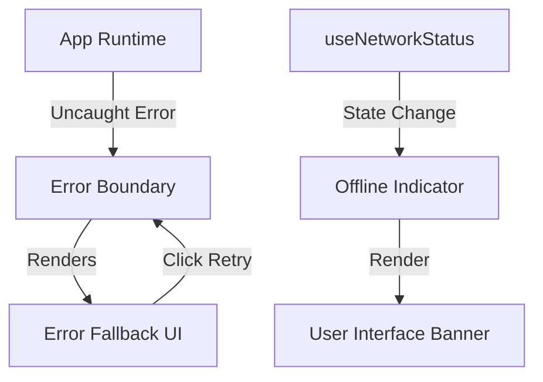

# App Stability & Error Handling

## Overview
This system provides comprehensive error handling, user-friendly feedback, and offline state detection to ensure a resilient user experience. It avoids "white screen" crashes and informs users when connectivity is lost.

## Architecture
- **Service/File:** `src/lib/errors.ts`
- **Hook:** `src/hooks/useNetworkStatus.ts`
- **UI Components:** `src/components/ui/ErrorBoundary.tsx`, `src/components/ui/ErrorFallback.tsx`, `src/components/ui/OfflineIndicator.tsx`

## Key Components

### 1. Custom Error Classes (`src/lib/errors.ts`)
Standardized error types for different failure scenarios:
- `ApiError`: For failed API requests with status codes and user-friendly messages.
- `NetworkError`: Specifically for connectivity issues.
- `PaymentError`: For transaction-related failures.
- `getUserFriendlyMessage(error)`: A helper to translate tech errors into human-readable strings.

### 2. Error Boundary (`src/components/ui/ErrorBoundary.tsx`)
A global React Error Boundary that wraps the entire application in `layout.tsx`. It catches rendering errors and prevents the entire app from crashing.

### 3. Error Fallback UI (`src/components/ui/ErrorFallback.tsx`)
The visual interface shown when an error is caught.
- **Friendly Message:** Human-readable text.
- **Retry Action:** Button to reset the error state and attempt re-render.
- **Technical Details:** Collapsible section for developers to see the stack trace and error object.

### 4. Offline Detection (`src/components/ui/OfflineIndicator.tsx`)
Uses the `useNetworkStatus` hook to detect when the browser goes offline.
- **Auto-Banner:** An orange banner appears at the top of the screen after a 2-second delay if the user is offline.
- **Real-time Updates:** Disappears instantly when the connection is restored.

## Integration
In `src/app/layout.tsx`:
```tsx
<ErrorBoundary>
  {children}
</ErrorBoundary>
<OfflineIndicator />
```

## Data Flow


## Changelog
### 2025-12-29: Initial Implementation
- Created global Error Boundary and Fallback UI.
- Implemented Offline Indicator with 2s debounce.
- Created custom error hierarchy in `src/lib/errors.ts`.
