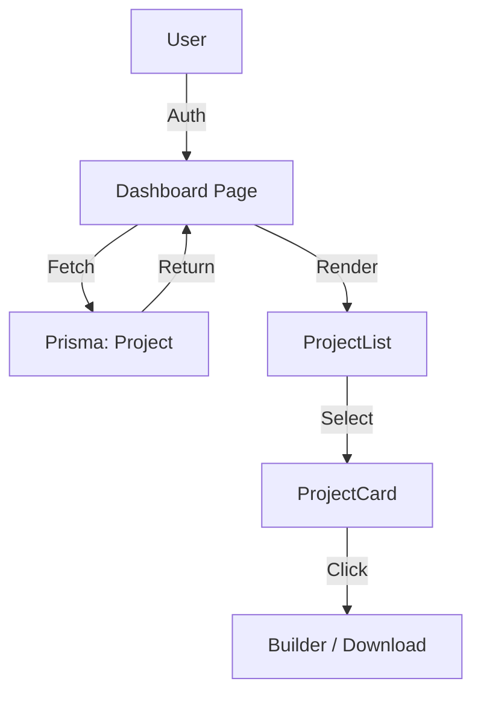

# FR-005: User Dashboard

## Overview
The User Dashboard is the central hub for authenticated users (Project Owners) to manage their projects. It provides a high-level view of active projects, status tracking, resource downloads, and quick actions.

## Architecture
- **Page:** `src/app/(saas)/dashboard/page.tsx`
- **Layout:** `src/app/(saas)/dashboard/layout.tsx` (Wrapped in `SaasShell`)
- **Shared Shell:** `src/features/ui/SaasShell.tsx`
- **Components:** `src/features/dashboard/components/*`
- **Dependencies:** Prisma (Project model), Better-Auth (Session)

## Key Components

### SaasShell
The unifying layout wrapper for Dashboard, Project, and Profile pages.
- **Header:** Standardized app header with context-aware "Action Button".
- **Back Navigation:** Shows "Back to Dashboard" when inside the Builder or Profile.
- **Profile Dropdown:** Avatar dropdown with "Profile" and "Sign Out" options.
- **Navigation:** Persistent `MobileBottomNav` ensures users never lose context.
- **Context Awareness:** Checks `hasActiveProject` to toggle between "New Project" (+) and "Continue Project" (Hammer).

### MobileBottomNav
A 5-column symmetrical grid navigation with active state highlighting:
- `Home` | `Projects` | **`Build (Hammer)`** | `Chat` | `Me`
- The central **Hammer** icon provides instant access to the Builder.
- Icons highlight white when active.

### Profile Page
Located at `/profile`.
- Displays user details (Name, Email, Account ID).
- Provides a clear "Sign Out" action.

### ProjectCard
Displays a summary of a single project, including:
- Dynamic status badge (Active, Completed, etc.)
- Progress indicator
- Quick actions (View, Download)

### StatusTimeline
A visual stepper showing the project's lifecycle:
1. Topic Approved
2. Payment (Pending -> Verified)
3. Generation in Progress
4. Final Review
5. Completed

## Data Flow

---

## Shared UI Components

### UserAvatar (`components/ui/UserAvatar.tsx`)
Reusable avatar component used across all authenticated pages.
- Shows `user.image` if available (Google/OAuth profile picture).
- Falls back to gradient initials if no image.
- Supports `sm`, `md`, `lg` sizes.
- Used in: `SaasShell`, `ChatInterface`, `ProfilePage`.

---

## Changelog

### 2025-12-31: Empty State & Avatar Improvements
- Removed broken "Start New Project" button from empty state (was non-functional).
- Created unified `UserAvatar` component for consistent profile pictures.
- Updated `SaasShell`, `ChatInterface`, and `ProfilePage` to use `UserAvatar`.

