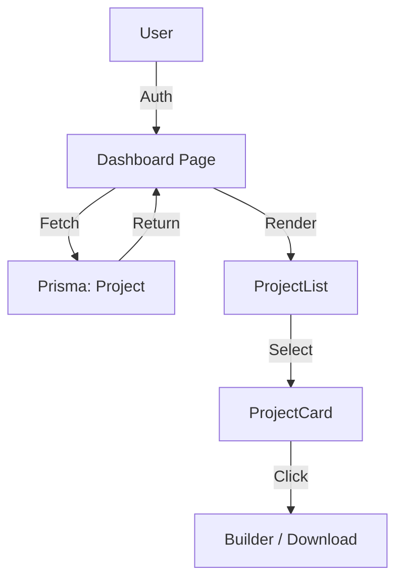

# FR-005: User Dashboard

## Overview
The User Dashboard is the central hub for authenticated users (Project Owners) to manage their projects. It provides a high-level view of active projects, status tracking, resource downloads, and quick actions. It replaces the previous verified-only access model with a persistent dashboard.

## Architecture
- **Page:** `src/app/(saas)/dashboard/page.tsx`
- **Layout:** `src/app/(saas)/dashboard/layout.tsx` (Wrapped in `SaasShell`)
- **Shared Shell:** `src/features/ui/SaasShell.tsx`
- **Components:** `src/features/dashboard/components/*`
- **Dependencies:** Prisma (Project model), Auth (Session)

## Key Components

### SaasShell
The unifying layout wrapper for both Dashboard and Project pages.
- **Header:** Standardized app header with context-aware "Action Button".
- **Navigation:** Persistent `MobileBottomNav` ensures users never lose context.
- **Context Awareness:** Checks `hasActiveProject` to toggle between "New Project" (+) and "Continue Project" (Hammer).

### MobileBottomNav
A 5-column symmetrical grid navigation:
- `Home` | `Projects` | **`Build (Hammer)`** | `Chat` | `Me`
- The central **Hammer** icon provides instant access to the Builder.

### ProjectCard
Displays a summary of a single project, including:
- Dynamic status badge (Active, Completed, etc.)
- Progress indicator
- Quick actions (View, Download)

### StatusTimeline
A visual stepper showing the project's lifecycle:
1. Topic Approved
2. Payment (Pending -> Verified)
3. Generation in Progress
4. Final Review
5. Completed

### UpsellSystem
Components that drive revenue:
- **UpsellBanner:** "Need a Human Touch?" promotional banner.
- **UpsellBridge:** "Done-For-You" visualization in the Builder flow.

### ResourceDownloads
A dedicated section for downloading generated assets:
- PDF Documentation
- DOCX Editable Drafts
- Research Materials

### UpsellBanner
"Need a Human Touch?" promotional banner connecting users to premium agency services.

## Data Flow

