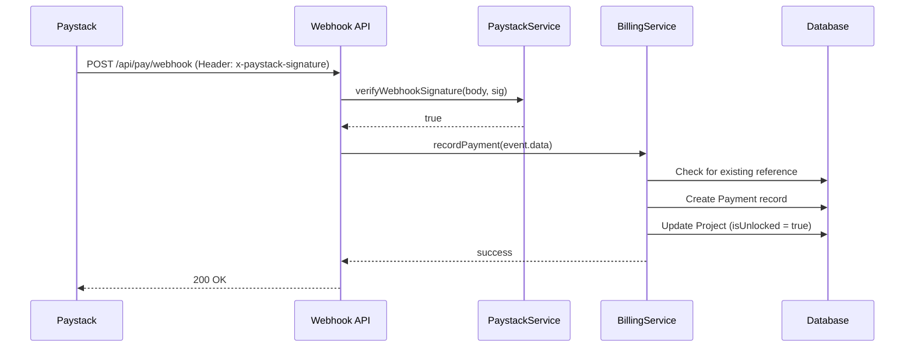

# FR-007: Payment Infrastructure & Webhooks

## Overview
Automated payment verification and fulfillment system using Paystack webhooks. This infrastructure ensures that when a user pays via Paystack, the system automatically records the transaction and unlocks the relevant project features.

## Architecture
- **Webhook Endpoint:** `src/app/api/pay/webhook/route.ts`
- **Fulfillment Brain:** `src/services/billing.service.ts`
- **Admin Links:** `src/app/api/admin/leads/[id]/send-payment-link/route.ts`
- **Gateway Service:** `src/services/paystack.service.ts`
- **Data Model:** `Payment` and `Project` models in Prisma.

## Key Components

### 1. Webhook Handlers
The system listens for specific Paystack events to trigger fulfillment:
- **`charge.success`**: Triggers `recordPayment` and project unlocking.
- **`transfer.success`**: (Planned) Handles automated refund logs.
- **`subscription.create`**: (Planned) Handles recurring billing for premium users.

### 2. Signature Verification
To prevent spoofing, every webhook request must be signed.
- **Algorithm**: HMAC-SHA512.
- **Implementation**: `PaystackService.verifyWebhookSignature(body, signature)`.
- **Secret**: `PAYSTACK_SECRET_KEY` (shared secret with Paystack).

### 3. Billing Service (`BillingService`)
The core busines logic for financial transactions:
- **`recordPayment(data)`**: 
    - Deduplicates events using transaction references (Idempotency).
    - Checks for the `projectId` in the Paystack `metadata`.
    - Creates a `Payment` record linked to the `User` and `Project`.
    - Triggers the unlocking process.
- **`updateProjectUnlock(projectId)`**: 
    - Sets `isUnlocked: true`.
    - Advances project status to `RESEARCH_IN_PROGRESS`.
    - **Lead Linking**: Retroactively updates `Lead` status to `PAID` via `topic` or `anonymousId` matching.

### 4. Admin Payment Links
Allows admins to send payment links to leads who haven't signed up yet.
- **Route:** `/api/admin/leads/[id]/send-payment-link`
- **Logic:**
    1. Finds or Creates a `Project` for the lead (Mode: `CONCIERGE`).
    2. Creates a `Payment` record linked to that Project.
    3. Generates Paystack link with `paymentId` in metadata.
- **Why:** Prevents "Record not found" errors during verification if the project didn't exist.

## Data Flow


## Security
1. **IP Whitelisting**: (Optional) Can be added to restricts POSTs to Paystack IPs.
2. **Signature Check**: Mandatory for every request.
3. **Idempotency**: Transaction references are unique in the `Payment` table.

## Manual Testing
A utility script is available at `scripts/test-webhook.ts` to simulate webhook events:
```bash
npx tsx scripts/test-webhook.ts
```
*Note: Ensure the local server is running and directed to the correct port (default 3000).*
