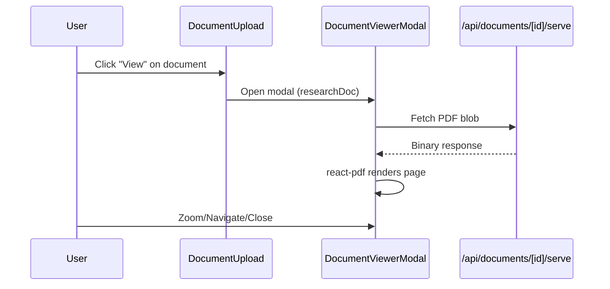

# FR-008: Document Viewer

## Goal
A modal-based document viewer for viewing research PDFs inline with zoom controls, page navigation, and AI-extracted metadata display.

## Status: ✅ Implemented

---

## Component Breakdown

### Client Components
| File | Purpose |
|------|---------|
| [DocumentViewerModal.tsx](file:///src/features/builder/components/DocumentViewerModal.tsx) | Modal with react-pdf rendering, zoom, navigation, metadata sidebar |
| [DocumentUpload.tsx](file:///src/features/builder/components/DocumentUpload.tsx) | Document upload & list, triggers viewer modal |

### API Endpoints
| File | Purpose |
|------|---------|
| [/api/documents/[id]/serve](file:///src/app/api/documents/[id]/serve/route.ts) | Serves document binary (PDF) for rendering |
| [/api/documents/[id]/extract](file:///src/app/api/documents/[id]/extract/route.ts) | AI extraction of metadata, summary, insights |

---

## Architecture

### PDF Rendering (react-pdf)
Uses `react-pdf` with dynamic imports for Next.js SSR compatibility:

```typescript
// Dynamic import with SSR disabled
const Document = dynamic(() => import("react-pdf").then((mod) => mod.Document), { ssr: false });
const Page = dynamic(() => import("react-pdf").then((mod) => mod.Page), { ssr: false });

// CDN worker setup (most reliable with Turbopack)
pdfjs.GlobalWorkerOptions.workerSrc = `https://unpkg.com/pdfjs-dist@${pdfjs.version}/build/pdf.worker.min.mjs`;
```

### Modal Layout
```
┌──────────────────────────────────────────────────────────┐
│ Header: Title | Zoom Controls | Page Nav | Close        │
├────────────────────────────────────┬─────────────────────┤
│                                    │   Metadata Sidebar  │
│    PDF Page                        │   - Summary         │
│    (react-pdf rendering)           │   - Author / Year   │
│                                    │   - AI Insights     │
│                                    │   - Keywords        │
│                                    │   - Download Button │
└────────────────────────────────────┴─────────────────────┘
```

---

## Key Features

### Zoom & Navigation
- Zoom range: 50% - 200% (25% increments)
- Page navigation with prev/next buttons
- Keyboard shortcuts: `←` / `→` for pages, `Escape` to close

- Sidebar auto-hides on mobile (<768px)
- Collapsible sidebar toggle
- Full-screen modal on mobile, rounded on desktop
- **Premium Glass UI**: Integrated background with refined padding for a leaner look

### Metadata Display
Parsed from `ResearchDocument` model fields:
- `title`, `author`, `year`, `documentType`
- `summary` - AI-generated abstract
- `keywords` - JSON array parsed to tags
- `insights` - JSON array parsed to insight cards

---

## Data Flow



---

## Dependencies
- `react-pdf` - PDF rendering
- `pdfjs-dist` - PDF.js library (peer dep)
- `next/dynamic` - SSR-safe imports
- `lucide-react` - Icons

---

## CSS (globals.css)
```css
/* React-PDF text layer styles */
.react-pdf__Page__textContent {
  line-height: 1.0;
  user-select: text;
}

.react-pdf__Page__textContent span::selection {
  background: rgba(139, 92, 246, 0.3);
}
```

---

## Implementation Checklist
- [x] react-pdf integration with dynamic import
- [x] PDF.js worker via CDN
- [x] Zoom controls (50-200%)
- [x] Page navigation
- [x] Metadata sidebar
- [x] Mobile responsive design
- [x] Keyboard shortcuts
- [x] CSS for text selection
- [ ] Text search within PDF (future)
