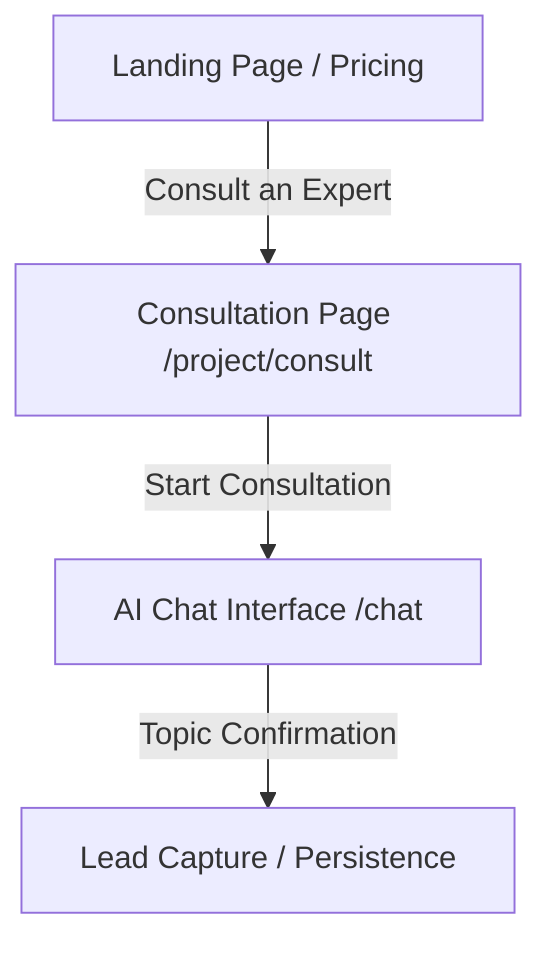

# FR-010: Agency Consultation Funnel

## Overview
A specialized, high-conversion lead-in page for the "Full Agency Service". This funnel is designed to introduce the Lead Project Architect (Jay) and bridge the gap between anonymous visitors and high-ticket consulting clients.

## Architecture
- **Route:** `src/app/(saas)/project/consult/page.tsx`
- **Key Asset:** `public/images/jay-portrait.png`
- **Primary CTA:** Redirects to `/chat` (AI Sales Consultant)

## Key Components

### 1. "Meet the Architect" Hero
- Features Jay's portrait with a grayscale-to-color hover transition.
- Establishes authority and professional trust.

### 2. Value Proposition Grid
- Highlights the "Distinction-Grade" methodology.
- Focuses on software build, academic documentation, and defense coaching.

### 3. Consultation Handoff
- Button: "Start Free Consultation".
- Links to the interactive chat interface where lead capture occurs.

## Data Flow

## Logic
- **Hover Effects:** Uses `framer-motion` for smooth entrance animations and vanilla CSS for the portrait's filter transitions.
- **Navigation:** Deep links directly into the Sales Consultant chat, passing intent if available.

## Checklist
- [x] Implement `/project/consult` route.
- [x] Integrate high-res portrait of Jay.
- [x] Create responsive value proposition layout.
- [x] Add animations via `framer-motion`.
- [x] Verify link connectivity from landing page.
