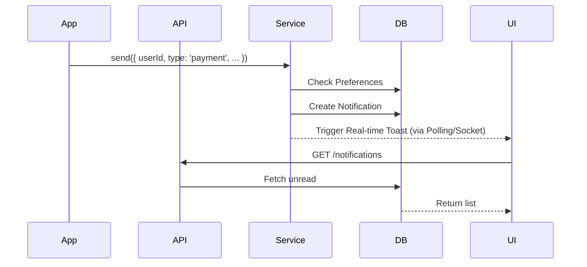

# FR-011: In-App Notification System

## Overview
A comprehensive notification system that keeps users informed about project updates, payments, and system alerts. It supports real-time in-app toasts, a persistent notification center, and email delivery preferences.

## Architecture
- **Service:** `src/services/inapp-notification.service.ts`
- **Database:** `InAppNotification`, `UserNotificationPreference` models
- **API Routes:** `/api/notifications/*`
- **UI Components:** `NotificationBell.tsx`, `NotificationList.tsx`

## Key Components

### 1. Database Schema
- **`InAppNotification`**: Stores the actual alerts (title, message, type, read status).
- **`UserNotificationPreference`**: Stores user settings (email vs in-app, categories).

### 2. Notification Service (`InAppNotificationService`)
Central service for dispatching alerts.
- **`send()`**: The main entry point. Checks user preferences before sending.
- **`createNotification()`**: Internal method to save to DB.
- **`markAsRead()`**: Updates read status.

### 3. API Endpoints
- `GET /api/notifications`: Fetch paginated user notifications.
- `PATCH /api/notifications/[id]/read`: Mark specific notification as read.
- `PATCH /api/notifications/mark-all-read`: Mark all as read.
- `GET /api/notifications/preferences`: Get user settings.
- `PATCH /api/notifications/preferences`: Update user settings.

### 4. UI Components
- **`NotificationBell`**: Navbar icon with unread badge count.
- **`NotificationCenter`**: Dropdown/Modal showing list of notifications.
- **`Toast` (Sonner)**: Real-time popup when a new notification arrives.

## Data Flow

## Categories
- **Payment**: Receipt confirmed, subscription renewal.
- **Project**: Milestone reached, AI generation complete.
- **System**: Maintenance alerts, new features.
- **Reminder**: "Complete your profile", "Continue project".

## Changelog
### 2025-12-30: Initial Implementation
- Complete service layer with preference checking.
- API routes for CRUD operations.
- Database migration (`InAppNotification` table).
