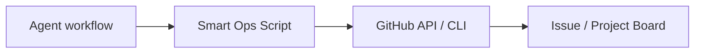

# SO-001: Smart Ops Automation Suite

## Overview
Smart Ops is a set of automation scripts and AI workflows designed to streamline the "VibeCode" development process. It bridges the gap between the GitHub CLI (`gh`) and the agentic coding environment, ensuring that every feature is tracked via an issue and documented upon completion.

## Architecture
- **Scripts:**
    - `scripts/smart-ops.ps1`: PowerShell automation for Windows.
    - `scripts/smart-ops.sh`: Bash automation for Git Bash/WSL/macOS.
- **Workflows:**
    - `.agent/workflows/smart_start.md`: Intelligent task initialization.
    - `.agent/workflows/smart_complete.md`: Intelligent task completion and cleanup.

## Key Components

### 1. The Professional Issue Template
Every issue created via Smart Ops follows a high-density "Architect" template including:
- User Stories
- Root Cause / Proposed Solution
- Acceptance Criteria
- Estimated vs Actual Duration tracking

### 2. Status Orchestration
Supports moving project items through a Kanban-style board (Todo -> In Progress -> Done) directly from the command line.

### 3. Duration Analytics
Tracks how many days a task took compared to its target date, providing feedback on development velocity.

## Data Flow

## Configuration
Requires `gh` CLI to be authenticated (`gh auth login`).

## Usage
- **Start work:** `/smart_start [description]`
- **Complete work:** `/smart_complete [description]`
- **List items:** `.\scripts\smart-ops.ps1 start`

## Checklist
- [x] Create cross-platform automation scripts.
- [x] Define `smart_start` logic with professional templates.
- [x] Define `smart_complete` logic with duration tracking.
- [x] Verify GitHub CLI connectivity.
