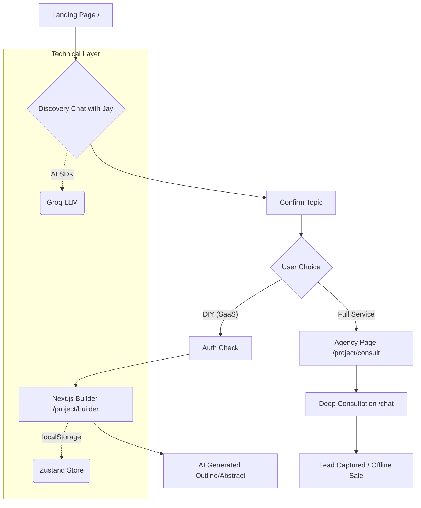

# J Star FYB Service: Application Flow & Philosophy

This document outlines the user journey and technical architecture of the J Star Final Year Project (FYB) service.

---

## 1. The Core Philosophy: "Two Paths to Glory"

The app is designed to cater to two distinct student segments:
1.  **The DIY Builder (SaaS):** Students with a limited budget who want AI to do the "heavy lifting" (abstracts, outlines) but will finish the project themselves.
2.  **The Full Agency Client:** Students who want a guaranteed distinction-grade result and are willing to pay for a bespoke software build + full documentation + defense coaching.

---

## 2. The User Journey (The Funnel)

### Phase 1: Awareness & Discovery
- **Landing Page:** Premium, futuristic vibe (VibeCode aesthetic).
- **Jay (Lead Architect):** Users meet Jay via the chat interface or the `/project/consult` page. 
- **The Conversation:** Jay acts as a sales consultant. He refines the user's project topic.

### Phase 2: The Fork in the Road
At the end of the initial chat, Jay provides a "Technical Proposal." The user then chooses:

#### Path A: The DIY Builder (`/project/builder`)
- **Payment:** Low-cost, instant unlock.
- **Handoff:** Topic/Twist stored in `localStorage` -> Hydrated into `useBuilderStore`.
- **Result:** AI generates a 5-chapter outline and a detailed abstract immediately.

#### Path B: The Agency Service (`/project/consult`)
- **High-Value Lead:** The user is funneled to a more personalized consultation.
- **Service:** Bespoke engineering by humans (augmented by J Star AI).
- **Handoff:** Lead captured via the chat interface (WhatsApp/Email capture) for human follow-up.

---

## 3. Technical Implementation

### Handoff Logic: Chat → Builder
When a user clicks "Proceed to Builder" in the chat:
1.  **State Capture:** The `confirmedTopic` and `twist` are saved to `localStorage` under `jstar_confirmed_topic`.
2.  **Redirect:** User is sent to `/project/builder`.
3.  **Hydration:** The Builder page calls `hydrateFromChat()` on mount, pulling the data from storage and skipping the "Topic Research" phase.

### Authentication (WorkOS)
- **Middleware Protected:** `/project/builder` and other SaaS features require a login.
- **Anonymous Continuity:** If a user chats with Jay while logged out, their history is merged automatically upon signup/login using `mergeAnonymousConversations`.

### AI Engine (Groq + Vercel AI SDK)
- **Llama 3 (70B):** Used for complex reasoning during the consultation and high-quality academic generation.
- **Streaming:** All AI responses use `streamText` or `streamObject` for a snappy, interactive feel.

---

## 4. Architectural Diagram (Mermaid)

