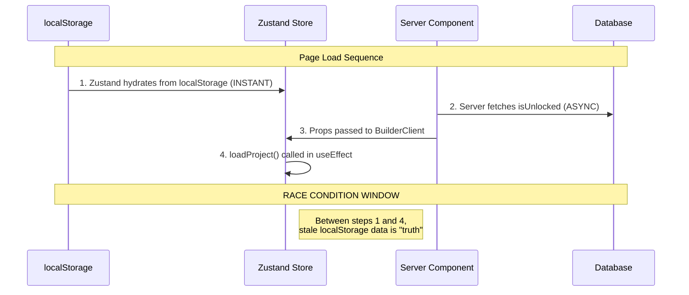

# Race Condition Research: Local Storage vs Database Sync

## Problem Statement

Users are experiencing a race condition where:
1. **Multi-Tab Conflicts**: Opening two different tabs causes state conflicts
2. **Cross-Device Desync**: Changes made on one device aren't reflected on another
3. **Payment Status Corruption**: Users appear as unpaid when they're actually paid
   - Admin portal shows correct "paid" status (`isUnlocked: true` in database)
   - User-facing UI shows "you haven't paid the 15k" (`isPaid: false` in Zustand)

---

## Architecture Overview



---

## Root Cause Analysis

### 🔴 Issue 1: Hydration Order Race Condition

**Location**: [useBuilderStore.ts](file:///c:/CreativeOS/01_Projects/Code/Personal_Stuff/Final%20Year%20Project%20service/2025-12-15_jstar-fyb-service/src/features/builder/store/useBuilderStore.ts)

```typescript
// Line 268 - Zustand persist configuration
storage: createJSONStorage(() => localStorage),
```

**The Problem**: Zustand's `persist` middleware hydrates from localStorage **synchronously before React renders**. This means:

1. Old `data` (topic, userId, projectId) loads instantly
2. Server-side component hasn't finished loading `isUnlocked` yet
3. For a brief moment, stale localStorage is treated as source of truth

**Evidence** (lines 269-276):
```typescript
partialize: (state) => ({
    // Only persist data, not step or UI flags
    // NOTE: isPaid is NOT persisted - server is source of truth for payment
    data: state.data,
    isFromChat: state.isFromChat
}),
```

> [!IMPORTANT]
> While `isPaid` is intentionally NOT persisted (good!), the **`data` object IS persisted**, which includes `userId` and `projectId`. This causes the `syncWithUser` logic to potentially block fresh server data.

---

### 🔴 Issue 2: No Server-First Fetch on Tab/Device Switch

**Location**: [BuilderClient.tsx](file:///c:/CreativeOS/01_Projects/Code/Personal_Stuff/Final%20Year%20Project%20service/2025-12-15_jstar-fyb-service/src/app/(saas)/project/builder/BuilderClient.tsx) (lines 37-65)

```typescript
// Priority: Server Data > Chat Handoff > localStorage (zustand persist handles this passively)
useEffect(() => {
    if (isPending) return;
    const hasFreshHandoff = hydrateFromChat(session?.user?.id, serverProject, serverIsPaid);
    if (hasFreshHandoff) return; // Chat data can override server!
    
    if (serverProject) {
        loadProject(serverProject, serverIsPaid); // Only loads IF serverProject exists
    }
    syncWithUser(session?.user?.id || null);
}, [isPending, serverProject, ...]);
```

**The Problem**: 
- When opening a second tab, `serverProject` is passed from the server component
- BUT, if `hasServerHydrated` was already set `true` in a previous session, `loadProject()` won't update the store!

**Evidence** (useBuilderStore.ts lines 176-180):
```typescript
syncWithUser: (userId) => {
    // If server has already hydrated, don't let localStorage-based logic overwrite
    if (hasServerHydrated) {
        console.log('[Builder] Server already hydrated, skipping syncWithUser reset');
        return; // ← BLOCKS FRESH DATA!
    }
```

---

### 🔴 Issue 3: `unlockPaywall()` Doesn't Persist to Server

**Location**: [usePaymentVerification.ts](file:///c:/CreativeOS/01_Projects/Code/Personal_Stuff/Final%20Year%20Project%20service/2025-12-15_jstar-fyb-service/src/features/builder/hooks/usePaymentVerification.ts)

```typescript
.then(resData => {
    if (resData.success) {
        unlockPaywall(); // ← Only updates Zustand! No DB write!
        setVerificationResult('success');
    }
})
```

**The Problem**: While the webhook (`/api/pay/verify`) correctly updates the database via `BillingService.updateProjectUnlock()`, the client-side `unlockPaywall()` ONLY updates local Zustand state.

This creates a **one-way sync issue**:
- ✅ Webhook → DB: Works
- ❌ Client → DB: No sync mechanism

---

### 🔴 Issue 4: Cross-Device/Tab Conflict Scenario

**Reproduction Steps**:
1. **Device A**: User pays → `isPaid = true` (local Zustand) + `isUnlocked = true` (database)
2. **Device B**: User opens app → localStorage is **STALE** (old session data)
3. **Device B**: Zustand hydrates with stale data → `isPaid = false`
4. **Device B**: Server component tries to inject `serverIsPaid = true`
5. **Device B**: BUT `hydrateFromChat()` or stale `hasServerHydrated` blocks the update!
6. **Result**: User sees "you haven't paid" even though DB shows paid

---

## Key Files Involved

| File | Role | Issue |
|------|------|-------|
| [useBuilderStore.ts](file:///c:/CreativeOS/01_Projects/Code/Personal_Stuff/Final%20Year%20Project%20service/2025-12-15_jstar-fyb-service/src/features/builder/store/useBuilderStore.ts) | Main state management | `hasServerHydrated` blocks fresh data; persist happens before server fetch |
| [BuilderClient.tsx](file:///c:/CreativeOS/01_Projects/Code/Personal_Stuff/Final%20Year%20Project%20service/2025-12-15_jstar-fyb-service/src/app/(saas)/project/builder/BuilderClient.tsx) | Hydration orchestrator | Priority logic can skip server data in edge cases |
| [page.tsx](file:///c:/CreativeOS/01_Projects/Code/Personal_Stuff/Final%20Year%20Project%20service/2025-12-15_jstar-fyb-service/src/app/(saas)/project/builder/page.tsx) | Server component | Fetches correct `isUnlocked` but arrives "late" to the party |
| [usePaymentVerification.ts](file:///c:/CreativeOS/01_Projects/Code/Personal_Stuff/Final%20Year%20Project%20service/2025-12-15_jstar-fyb-service/src/features/builder/hooks/usePaymentVerification.ts) | Payment callback | `unlockPaywall()` is local-only, no server sync |

---

## Recommended Fixes

> [!NOTE]
> These are preliminary recommendations pending further analysis

### Fix 1: Force Server Truth on Every Load
```typescript
// In loadProject(), ALWAYS accept server data regardless of hasServerHydrated 
// for critical fields like isPaid
loadProject: (projectData, isPaid = false) => {
    // Don't check hasServerHydrated for payment status!
    set((state) => ({
        ...state,
        isPaid: isPaid, // Server is ALWAYS source of truth for payment
        data: { ...state.data, ...projectData },
        hasServerHydrated: true
    }));
}
```

### Fix 2: Add Server Refresh API
Create an endpoint to forcefully sync payment status:
```typescript
// New API: GET /api/project/sync-status?projectId=xxx
// Returns { isPaid, status, ... } directly from DB
// Call this on window focus/visibility change
```

### Fix 3: Use BroadcastChannel for Multi-Tab Sync
```typescript
// Notify other tabs when payment status changes
const channel = new BroadcastChannel('jstar-payment-sync');
channel.postMessage({ type: 'PAYMENT_UNLOCKED', projectId });
```

### Fix 4: Clear stale `hasServerHydrated` on each navigation
```typescript
// In BuilderClient, reset at the START of hydration
useEffect(() => {
    // First, reset the "already hydrated" flag to allow fresh data
    useBuilderStore.setState({ hasServerHydrated: false });
    // Then proceed with normal hydration...
}, []);
```

---

*Document last updated: Investigation Complete*
